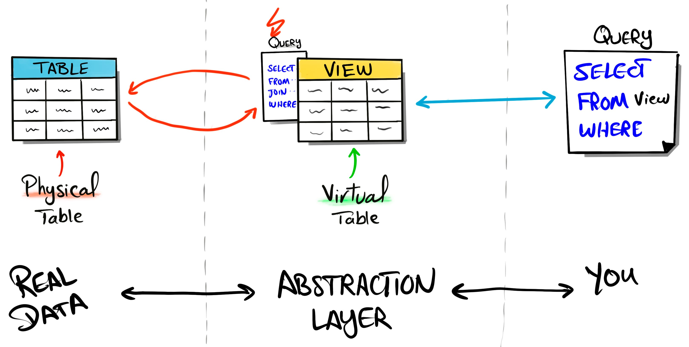

# Conceitos e criação de VIEW
Uma view é uma tabela virtual definida por uma consulta SELECT. Ela não armazena (normalmente) os dados por si só

## O que é uma VIEW
Uma view é como uma janela para os dados de uma tabela ou várias tabelas.

Ela não é uma tabela de verdade, mas parece uma.

A view pode ser definida como uma tabela virtual composta por linhas e colunas de dados vindos de tabelas relacionadas em uma query (um agrupamento de SELECT’s, por exemplo). As linhas e colunas da view são geradas dinamicamente no momento em que é feita uma referência a ela.

Como já dito, a query que determina uma view pode vir de uma ou mais tabelas, ou até mesmo de outras views.



## Vantagens das Views
Temos muitos motivos e vantagens para usarmos views em nossos projetos. A seguir são citados três que podem fazer a diferença:

- Reuso: as views são objetos de caráter permanente. Pensando pelo lado produtivo isso é excelente, já que elas podem ser lidas por vários usuários simultaneamente.

- Segurança: as views permitem que ocultemos determinadas colunas de uma tabela. Para isso, basta criarmos uma view com as colunas que acharmos necessário que sejam exibidas e as disponibilizarmos para o usuário.

- Simplificação do código: as views nos permitem criar um código de programação muito mais limpo, na medida em que podem conter um SELECT complexo. Assim, criar views para os programadores a fim de poupá-los do trabalho de criar SELECT’s é uma forma de aumentar a produtividade da equipe de desenvolvimento.

## Como utilizar uma VIEW
Usar uma view é basicamente:

1 - Criar uma view (salvar um SELECT com um nome)

2 - Consultar essa view como se fosse uma tabela

3 - Atualizar dados pelas views (nem sempre é permitido)

4 - Alterar ou apagar views

### 1 - Como criar uma VIEW
Você cria uma view usando:

```sql
CREATE VIEW nome_da_view_VW AS
SELECT ...
FROM ...
WHERE ...;
```

Criando uma tabela real:

```sql
CREATE VIEW clientes_ativos_VW AS
SELECT id, nome, email
FROM clientes
WHERE status = 'ativo';
```

### 2 - Como consultar uma VIEW
Usar uma view é igual consultar uma tabela:

```sql
SELECT * FROM clientes_ativos_VW
```

O banco vai:

- pegar o SELECT salvo dentro da view,
- rodar esse SELECT,
- te mostrar o resultado atualizado naquele momento.

#### Exemplo prático
Se você desativar um cliente:

```sql
UPDATE clientes SET status = 'inativo' WHERE id = 10;
```

E consultar uma view:

```sql
SELECT * FROM clientes_ativos_VW
```

Esse cliente some da view automaticamente. Porque ela sempre reflete os dados atuais.

### 3 - Como filtrar e ordenar uma VIEW
```sql
SELECT nome
FROM clientes_ativos
WHERE email LIKE '%gmail.com'
ORDER BY nome;

```
A view funciona como uma tabela “virtual” para facilitar seu SQL.
