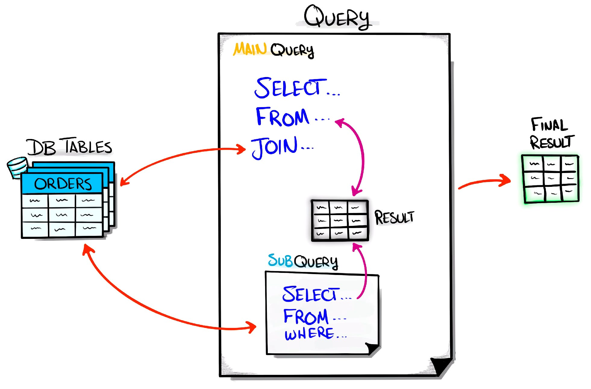

# SQL: Subquery
Uma subconsulta (mais conhecida como SUBQUERY ou SUBSELECT) é uma instrução do tipo SELECT dentro de outra instrução SQL.

## Por que usar uma subquery?

Porque às vezes você precisa:

- buscar um dado que depende de outro dado
- comparar um valor com o resultado de um SELECT
- filtrar linhas com base em outra tabela
- encontrar valores máximos, mínimos, contagens, etc.

## Estrutura básica
```sql
SELECT ...
FROM tabela
WHERE coluna = (SELECT ...);
```



## Tipos de subquery
Existem diferentes jeitos de utilizar uma subquery. Sendo elas:

### Subquery no WHERE
- Liste os produtos com preço igual ao maior preço da tabela.

```sql
SELECT nome, preco
FROM produtos
WHERE preco = (
    SELECT MAX(preco) 
    FROM produtos
);

```

### Subquery no SELECT
Você pode colocar uma subquery como uma coluna:

```sql
SELECT 
    nome,
    (SELECT AVG(valor) FROM pedidos) AS media_pedidos
FROM clientes;

```

### Subquery no FROM
Quero pegar a média dos preços, mas antes quero filtrar os produtos caros.

```sql
SELECT AVG(preco) AS media_preco_caros
FROM (
    SELECT preco
    FROM produtos
    WHERE preco > 1000
) AS produtos_caros;

```