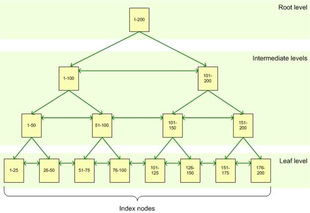

# INDEX no SQL

## O que é um Index? 
Um Index é uma estrutura de dados criada em uma ou mais colunas da tabela para acelerar consultas.

Ele funciona como o índice de um livro:

- sem índice → você lê página por página até achar o conteúdo;
- com índice → você abre o índice, vai direto ao número da página.

No banco:

- sem índice → o banco lê linha por linha (full table scan);
- com índice → o banco usa o índice para pular direto nas linhas correspondentes.

## Estrutura interna: por que ele é rápido?
A maioria dos bancos (MySQL, PostgreSQL, SQL Server) usa árvores B-Tree para armazenar índices.

Por que isso acelera?

### A B-tree mantém os dados ordenados

Isso ajuda muito em:

- buscas pelo valor exato
- buscas por intervalos (>, <, BETWEEN)
- ordenações (ORDER BY)

### A árvore é balanceada

Isso garante que a distância da raiz até a folha seja sempre curta → poucos passos para chegar ao resultado.




## Tipos de Índices Mais Importantes
A seguir, cada tipo importante e como funciona:

### Index simples
É um índice criado sobre 1 única coluna.

- Usos perfeitos: buscas diretas.
```sql
CREATE INDEX idx_nome ON clientes (nome);
```

- Agora consultas assim ficam mais rápidas:
```sql
SELECT * FROM clientes WHERE nome = 'Ana';
```

### Index composto
É um índice criado sobre duas ou mais colunas.

- O mais importante aqui é a ordem das colunas.
```sql
CREATE INDEX idx_nome_cidade ON clientes (nome, cidade);
```

Esse índice será eficiente somente quando a consulta usar nome como primeira condição:
Exemplos:

```sql
SELECT * FROM clientes 
WHERE nome = 'Ana' AND cidade = 'Curitiba';
```

```sql
SELECT * FROM clientes 
WHERE nome = 'Ana';
```

Não vai funcionar bem:
```sql
SELECT * FROM clientes 
WHERE cidade = 'Curitiba';
```
Porque "nome" vem primeiro na ordem do índice.

## Quando usar Index? 
Use índice quando a coluna for frequentemente usada para localizar registros.

- Em colunas usadas no WHERE
```sql
SELECT * FROM pedidos WHERE cliente_id = 100;
```

- Em colunas usadas em JOIN
```sql
SELECT * 
FROM pedidos 
JOIN clientes ON pedidos.cliente_id = clientes.id;
```

- Em colunas usadas em ORDER BY
```sql
SELECT * FROM produtos ORDER BY preco;
```

## Quando não usar Index?
Índices não são sempre bons; eles também têm custos.

### Colunas com poucos valores diferentes

Exemplos:
- sexo: M/F
- status: ativo/inativo
- booleanos: true/false

Nesses casos o banco ainda terá que varrer quase a tabela inteira.

### Colunas que mudam MUITO

Toda vez que o dado muda, o índice precisa ser atualizado.
Isso desacelera INSERT, UPDATE e DELETE.

## Criar, ver e deletar índices
### Criar índice simples
```sql
CREATE INDEX idx_cpf ON clientes (cpf);
```

### Criar índice composto
```sql
CREATE INDEX idx_nome_cidade ON clientes (nome, cidade);
```

### Criar índice único
```sql
CREATE UNIQUE INDEX idx_email ON usuarios (email);
```
