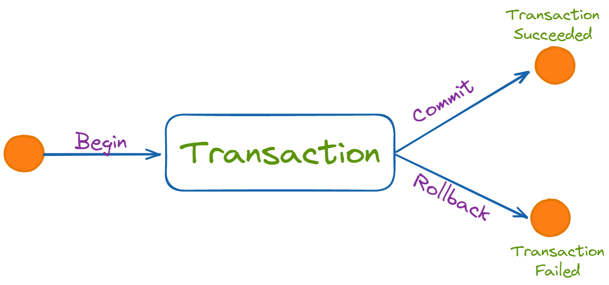

# Controle transacional

Controle transacional é o conjunto de regras e comandos que garantem que as operações no banco de dados sejam:

- seguras
- consistentes
- confiáveis
- sem perdas ou corrupções de dados

Ele controla como uma mudança é feita, e quando essa mudança deve ser confirmada ou cancelada.

## O que é uma transação
Uma transação é um conjunto de operações SQL que deve ser tratado como uma única unidade.

**"Ou tudo acontece com sucesso, ou nada acontece."**

## Propriedades ACID (fundamento do controle transacional)
As transações seguem 4 regras:

### Atomicidade (A)
- “Tudo ou nada.”
- Se uma parte falha, o banco desfaz tudo.

### Consistência (C)
O banco nunca fica em estado inválido.

### Isolamento (I)
Transações não atrapalham umas às outras.

### Durabilidade (D)
Depois que você confirma a transação, o dado fica salvo até se faltar energia.

## Comandos do Controle Transacional

### 1 - BEGIN ou START TRANSACTION
Inicia uma transação.

```sql
START TRANSACTION;
```

### 2 - COMMIT
Confirma tudo que foi feito.

```sql
COMMIT;
```

Depois do commit:

- dados salvos
- persistidos em disco
- não dá para desfazer (a não ser com backup)

### 3 - ROLLBACK
Cancela tudo que foi feito desde o início da transação.

```sql
ROLLBACK;
```

Depois do rollback:

- o banco volta ao estado anterior
- nada é salvo
- é como se você não tivesse feito nada



## Utilizando transactions

```sql
START TRANSACTION;

UPDATE contas
SET saldo = saldo - 300
WHERE id = 1;

UPDATE contas
SET saldo = saldo + 300
WHERE id = 2;

COMMIT; --ou ROLLBACL

```
